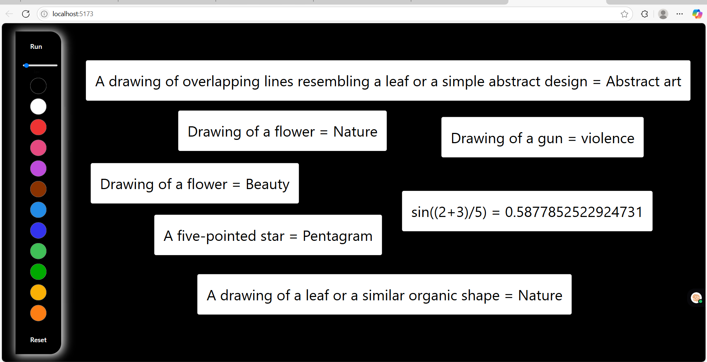

# 🖋️ ScribbleNsense

> **Intelligent Handwritten Math Expression Recognition Platform**

ScribbleNsense is a cutting-edge web application that transforms handwritten mathematical expressions into beautifully rendered LaTeX equations. Draw your math expressions naturally on a digital canvas and watch them come to life with instant LaTeX conversion and rendering.


---

## ✨ Features

- 🎨 **Intuitive Canvas Drawing** - Natural freehand drawing experience with smooth brush strokes
- 🔍 **AI-Powered Recognition** - Advanced image processing to recognize mathematical symbols and expressions
- 📐 **LaTeX Conversion** - Instant conversion of drawings to proper LaTeX mathematical notation
- 🎯 **Real-time Rendering** - Live preview of rendered mathematical expressions using MathJax
- 📱 **Responsive Design** - Seamless experience across desktop. tablet, and mobile-- require improvements
- ⚡ **Fast Performance** - Optimized with Vite for lightning-fast development and production builds
- 🎨 **Modern UI** - Beautiful, accessible interface built with Tailwind CSS and shadcn/ui components

---

## 🛠️ Tech Stack

### Frontend
- **Framework**: React 18 with TypeScript
- **Build Tool**: Vite
- **Styling**: Tailwind CSS
- **UI Components**: shadcn/ui
- **Canvas**: HTML5 Canvas API
- **Math Rendering**: MathJax
- **HTTP Client**: Axios

### Backend
- **Framework**: FastAPI
- **Language**: Python 3.10+
- **Image Processing**: Pillow (PIL)
- **Data Validation**: Pydantic
- **CORS**: FastAPI CORS middleware

### Development & Deployment
- **Package Manager**: npm/yarn, pip
- **Linting**: ESLint
- **Code Formatting**: Prettier
- **Frontend Hosting**: Vercel
- **Backend Hosting**: Render
- **Version Control**: Git

---

## 📁 Project Structure

```plaintext
scribbleNsense/
├── 📂 scribbleNsense-frontend/          # React + TypeScript frontend
│   ├── 📂 public/                       # Static assets
│   ├── 📂 src/
│   │   ├── 📂 components/              # Reusable UI components
│   │   │   └── 📂 ui/                  # shadcn/ui components
│   │   ├── 📂 screens/                 # Main application screens
│   │   │   └── 📂 home/               # Home page with canvas
│   │   ├── 📂 lib/                     # Utility functions
│   │   ├── 📂 assets/                  # Images and icons
│   │   ├── 📄 App.tsx                  # Main app component
│   │   ├── 📄 main.tsx                 # React entry point
│   │   └── 📄 constants.ts             # App constants
│   ├── 📄 package.json                 # Dependencies and scripts
│   ├── 📄 vite.config.ts              # Vite configuration
│   ├── 📄 tailwind.config.js          # Tailwind CSS config
│   └── 📄 tsconfig.json               # TypeScript config
├── 📂 scribbleNsense-backend/           # FastAPI Python backend
│   ├── 📂 apps/
│   │   └── 📂 calculator/              # Calculator module
│   │       ├── 📄 route.py            # API routes
│   │       └── 📄 utils.py            # Utility functions
│   ├── 📄 main.py                      # FastAPI application
│   ├── 📄 schema.py                    # Pydantic models
│   ├── 📄 constants.py                 # Backend constants
│   ├── 📄 requirements.txt             # Python dependencies
│   └── 📄 .env                        # Environment variables
├── 📄 README.md                        # This file
└── 📄 .gitignore                       # Git ignore rules
```

---

## 🚀 Quick Start

### Prerequisites

- **Node.js** 18+ and npm/yarn
- **Python** 3.10+
- **Git**

### 1. Clone the Repository

```bash
git clone https://github.com/shailendra-iiitm/scribbleNsense
cd scribbleNsense
```

### 2. Backend Setup

```bash
# Navigate to backend directory
cd scribbleNsense-backend

# Create virtual environment
python -m venv venv

# Activate virtual environment
# On Windows:
venv\Scripts\activate
# On macOS/Linux:
source venv/bin/activate

# Install dependencies
pip install -r requirements.txt

# Set up environment variables
cp .env.example .env
# Edit .env with your configuration

# Run the backend server
python main.py
```

The backend will be available at `http://localhost:8000`

### 3. Frontend Setup

```bash
# Navigate to frontend directory (in a new terminal)
cd scribbleNsense-frontend

# Install dependencies
npm install

# Set up environment variables
cp .env.example .env
# Edit .env with your backend URL

# Start development server
npm run dev
```

The frontend will be available at `http://localhost:5173`



---

## 📖 API Documentation

### Base URL
- **Development**: `http://localhost:8000`
- **Production**: `https://your-backend-url.com`

### Endpoints

#### `POST /calculate`
Process handwritten mathematical expression

**Request Body:**
```json
{
  "image": "data:image/png;base64,iVBORw0KGgoAAAANSUhEUgAA...",
  "dict_of_vars": {}
}
```

**Response:**
```json
{
  "expr": "x^2 + 2x + 1",
  "result": "LaTeX rendered result",
  "assign": false
}
```

### Data Models

#### ImageData
```python
class ImageData(BaseModel):
    image: str          # Base64 encoded image string
    dict_of_vars: dict  # Variable assignments
```

---

## 🎯 Usage

1. **Open the Application** - Navigate to the frontend URL in your browser
2. **Draw Your Expression** - Use your mouse or touch to draw mathematical expressions on the canvas
3. **Process** - Click the "RUN" button to send your drawing for recognition
4. **View Results** - See the recognized LaTeX expression and its rendered output
5. **Clear & Repeat** - Use the clear button to start over with a new expression

### Supported Mathematical Elements

- ✅ Basic arithmetic: `+`, `-`, `×`, `÷`
- ✅ Exponents and subscripts: `x²`, `a₁`
- ✅ Fractions: `1/2`, `(a+b)/c`
- ✅ Greek letters: `α`, `β`, `π`, `θ`
- ✅ Functions: `sin`, `cos`, `log`, `√`
- ✅ Parentheses and brackets
- ✅ Integrals and summations

---

## 🛠️ Development

### Available Scripts (Frontend)

```bash
npm run dev          # Start development server
npm run build        # Build for production
npm run preview      # Preview production build
npm run lint         # Run ESLint
npm run type-check   # Run TypeScript type checking
```

### Available Scripts (Backend)

```bash
python main.py       # Start development server
pip freeze > requirements.txt  # Update dependencies
pytest              # Run tests (if implemented)
```

### Environment Variables

#### Frontend (.env)
```env
VITE_API_BASE_URL=http://localhost:8000
VITE_APP_NAME=ScribbleNsense
```

#### Backend (.env)
```env
PORT=8000
ENVIRONMENT=development
CORS_ORIGINS=["http://localhost:5173"]
```

---

## 🚀 Deployment  --Planned

### Frontend (Vercel)

1. Connect your GitHub repository to Vercel
2. Set environment variables in Vercel dashboard
3. Deploy automatically on push to main branch

### Backend (Render)

1. Connect your GitHub repository to Render
2. Choose "Web Service" and configure:
   - **Build Command**: `pip install -r requirements.txt`
   - **Start Command**: `python main.py`
3. Set environment variables in Render dashboard

---

## 🤝 Contributing

We welcome contributions! Please follow these steps:

1. **Fork** the repository
2. **Create** a feature branch (`git checkout -b feature/amazing-feature`)
3. **Commit** your changes (`git commit -m 'Add amazing feature'`)
4. **Push** to the branch (`git push origin feature/amazing-feature`)
5. **Open** a Pull Request


## 📝 License

This project is licensed under the **MIT License** - see the [LICENSE](LICENSE) file for details.

---

## 👥 Authors & Contributors

<table>
  <tr>
    <td align="center">
      <a href="https://github.com/Anisha1121">
        
        <br />
        <sub><b>Anisha Dwivedi</b></sub>
      </a>
      <br />
      <span title="Code">💻</span> <span title="Frontend">🎨</span> <span title="UI/UX">🎯</span>
    </td>
    <td align="center">
      <a href="https://github.com/shailendra-iiitm">
        
        <br />
        <sub><b>Shailendra Shukla</b></sub>
      </a>
      <br />
      <span title="Code">💻</span> <span title="Architecture">🏗️</span> <span title="Backend">⚙️</span>
    </td>
    
  </tr>
</table>

---

## 📞 Support & Contact

- 🐛 **Bug Reports**: [Create an Issue](https://github.com/shailendra-iiitm/scribbleNsense/issues)
- 💡 **Feature Requests**: [Create an Issue](https://github.com/shailendra-iitm/scribbleNsense/issues)
- 📧 **Email**: shailendraiiits@example.com ,anishas1121@gmail.co

---

## 🙏 Acknowledgments

- **MathJax** for mathematical rendering
- **shadcn/ui** for beautiful UI components  
- **FastAPI** for the excellent Python web framework
- **Vite** for blazing fast build tooling
- **Tailwind CSS** for utility-first styling
- All contributors and supporters of this project

---

<div align="center">
  <p>⭐ Star this repo if you find it helpful!</p>
</div>
